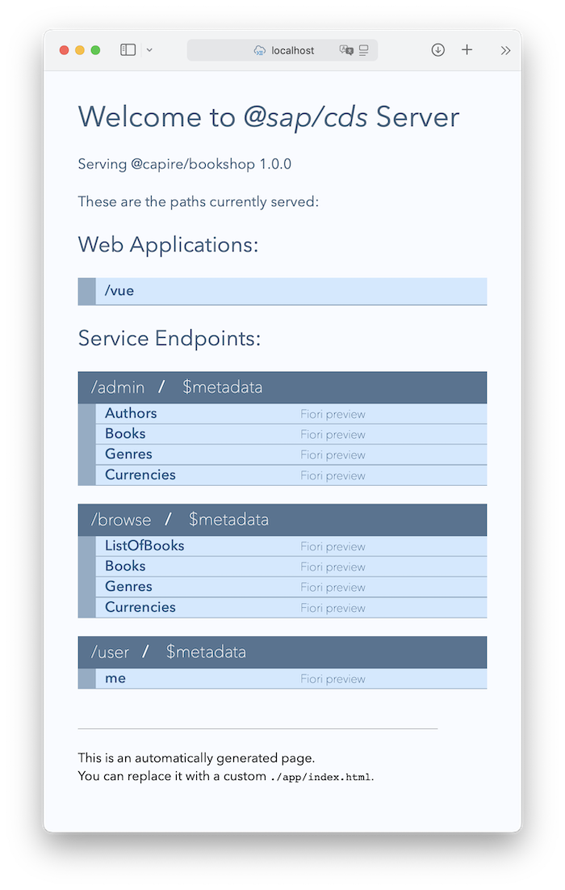
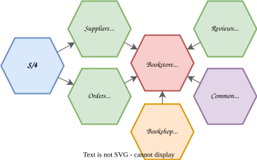

# Welcome to cap/samples

Find here a collection of samples for the [SAP Cloud Application Programming Model](https://cap.cloud.sap) organized in a simple [monorepo setup](about/samples.md#all-in-one-monorepo).


## Get Started

Assumed you did your [initial setup of CAP Node.js](https://cap.cloud.sap/docs/get-started/#setup), simply copy & paste these lines to a terminal for a jumpstart:

```sh
git clone -j11 -q --recursive https://github.com/capire/samples cap/samples -b ecosystem-session
cd cap/samples
npm run latest
npm install
npm test
npm start
```

After download and setup this starts the bookshop server and opens a browser window on _http://localhost:4004_ looking like that:

<p align="center">
   
</p>

Click on the *[/vue](http:/localhost:4004/vue)* link at the top to display the bookshop app (when asked to log in, type `alice` as user and leave the password field blank).

## Grow as you go...

After the jumpstart, have a look into the enclosed sub folders/projects, which are:

- [bookshop](bookshop) – a simple [primer app](https://cap.cloud.sap/docs/get-started/in-a-nutshell)
- [reviews](reviews) - a generic reuse service
- [orders](orders) - a generic reuse service
- [common](common) - a reuse content package
- [bookstore](bookstore) - a composite app of the above

> _[Learn more...](about/samples.md)_

<p align="center">
  
</p>

## Run Locally

### ... with mocks

```sh
cds w bookstore
```

This shows the mocking of the `OrdersService` in the terminal output like this:
```
[cds] - mocking OrdersService {
  at: [ '/odata/v4/orders' ],
  decl: 'orders/srv/orders-service.cds:4',
  impl: 'node_modules/@sap/cds/srv/app-service.js'
}
```

The `impl` is the default app-service implementation provided by CAP.

Test it:
- submit an order at http://localhost:4004/bookshop/
- see the order appear at http://localhost:4004/odata/v4/orders/Orders

### ... connected

> Just including `DEBUG=all` because it's useful to know it when needed.

```sh
DEBUG=all cds w orders
```

```sh
DEBUG=all cds w bookstore
```

This shows the connection to the real `OrdersService` in the terminal output like this:
```
[cds] - connect to OrdersService > odata { url: 'http://localhost:4006/odata/v4/orders' }
```

The connection is automatically picked up due to the `~/.cds-services.json` entry created when starting the `orders` service.


Test it:
- submit an order at http://localhost:4004/bookshop/
- see the order appear at http://localhost:4006/orders/#manage-orders (need to press "Go")
- delete the order
- see the stock go up at http://localhost:4004/bookshop/ (refresh the page)


### ... as modulith

```sh
cds w
```

Test it:
- submit an order at http://localhost:4004/bookshop/
- see the order appear at http://localhost:4004/orders/#manage-orders (need to press "Go")
- delete the order
- see the stock go up at http://localhost:4004/bookshop/ (refresh the page)

## Get Help

- Visit the [*capire* docs](https://cap.cloud.sap) to learn about CAP.
- Especially [*Getting Started in a Nutshell*](https://cap.cloud.sap/docs/get-started/in-a-nutshell).
- Visit our [*SAP Community*](https://answers.sap.com/tags/9f13aee1-834c-4105-8e43-ee442775e5ce) to ask questions.


## Get Support

In case you have a question, find a bug, or otherwise need support, please use our [community](https://answers.sap.com/tags/9f13aee1-834c-4105-8e43-ee442775e5ce). See the documentation at [https://cap.cloud.sap](https://cap.cloud.sap) for more details about CAP.

## License

Copyright (c) 2022 SAP SE or an SAP affiliate company. All rights reserved. This file is licensed under the Apache Software License, version 2.0 except as noted otherwise in the [LICENSE](LICENSE) file.